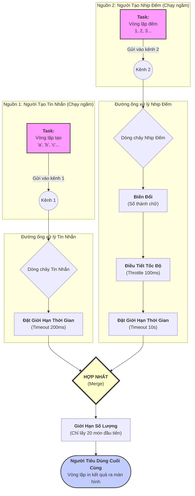

# Mã chương trình ví dụ:

Example code:

```rust
use std::{pin::pin, time::Duration};
use trpl::{ReceiverStream, Stream, StreamExt};

fn get_messages() -> impl Stream<Item = String> {
    let (tx, rx) = trpl::channel();

    trpl::spawn_task(async move {
        let messages = ["a", "b", "c", "d", "e", "f", "g", "h", "i", "j"];
        for (index, message) in messages.into_iter().enumerate() {
            let time_to_sleep = if index % 2 == 0 { 100 } else { 300 };
            trpl::sleep(Duration::from_millis(time_to_sleep)).await;
            if let Err(send_error) = tx.send(format!("Message: '{message}'")) {
                eprintln!("Cannot send message '{message}': {send_error}");
                break;
            };
        }
    });

    ReceiverStream::new(rx)
}

fn get_intervals() -> impl Stream<Item = u32> {
    let (tx, rx) = trpl::channel();

    trpl::spawn_task(async move {
        let mut count = 0;
        loop {
            trpl::sleep(Duration::from_millis(1)).await;
            count += 1;
            if let Err(send_error) = tx.send(count) {
                eprintln!("Could not send interval {count}: {send_error}");
                break;
            };
        }
    });

    ReceiverStream::new(rx)
}

fn main() {
    trpl::run(async {
        println!("==========block1===========");
        let values = [1, 2, 3, 4, 5, 6, 7, 8, 9, 10];
        let iter = values.iter().map(|n| n * 2);
        let stream = trpl::stream_from_iter(iter);

        let mut filtered = stream.filter(|value| value % 3 == 0 || value % 5 == 0);

        while let Some(value) = filtered.next().await {
            println!("The value was: {value}");
        }
    });

    trpl::run(async {
        println!("==========block2===========");
        let mut messages = get_messages();

        while let Some(message) = messages.next().await {
            println!("{message}");
        }
    });

    trpl::run(async {
        println!("==========block3===========");
        let mut messages = pin!(get_messages().timeout(Duration::from_millis(200)));

        while let Some(result) = messages.next().await {
            match result {
                Ok(message) => println!("{message}"),
                Err(reason) => eprintln!("Problem: {reason:?}"),
            }
        }
    });

    trpl::run(async {
        println!("==========block4===========");
        let messages = get_messages().timeout(Duration::from_millis(200));
        let intervals = get_intervals()
            .map(|count| format!("Interval: {count}"))
            .throttle(Duration::from_millis(100))
            .timeout(Duration::from_secs(10));
        let merged = messages.merge(intervals).take(20);
        let mut stream = pin!(merged);
        while let Some(result) = stream.next().await {
            match result {
                Ok(message) => println!("{message}"),
                Err(reason) => eprintln!("Problem: {reason}"),
            }
        }
    });
}
```

  Phần 1: Lọc Stream
  
```bash
   The value was: 6
   The value was: 10
   The value was: 12
   The value was: 18
   The value was: 20
```
   * Phân tích: Đây là kết quả của khối đầu tiên. Chương trình tạo một luồng từ [1..10], nhân mỗi số với 2,
     sau đó chỉ giữ lại những số chia hết cho 3 hoặc 5. Kết quả hoàn toàn chính xác.

  Phần 2: Nhận Message đơn giản

```
Message: 'a'
Message: 'b'
...
Message: 'j'
```

   * Phân tích: Khối thứ hai chỉ đơn giản là nhận và in ra tất cả các tin nhắn từ hàm get_messages. 10 tin
     nhắn đã được in ra đầy đủ. Hoạt động đúng.

  Phần 3: Stream với Timeout (dùng Debug {:?})
```
Message: 'a'
Problem: Elapsed(())
Message: 'c'
Problem: Elapsed(())
Message: 'e'
...
```

   * Phân tích: Khối thứ ba thêm một timeout(200ms).
       * Các tin nhắn ở vị trí chẵn ('a', 'c', 'e'...) được gửi sau 100ms, đến kịp trước timeout, nên được
         in ra.
       * Các tin nhắn ở vị trí lẻ ('b', 'd', 'f'...) được gửi sau 300ms, đến trễ và gây ra lỗi timeout.
       * Lỗi được in ra là Problem: Elapsed(()). Đây là kết quả của việc dùng {:?} (định dạng Debug) để in
         lỗi. Hoạt động đúng như mong đợi.

  Phần 4: Gộp (Merge) Stream (dùng Display {})

```
Interval: 1
Message: 'a'
Interval: 2
Interval: 3
Problem: deadline has elapsed
Interval: 4
Message: 'b'
...
```

   * Phân tích: Đây là khối phức tạp nhất, gộp hai luồng lại với nhau và lấy 20 giá trị đầu tiên (take(20)).
       * Bạn có thể thấy các dòng Interval: và Message: được in ra xen kẽ. Điều này cho thấy hàm merge đang
         hoạt động, nó nhận giá trị từ bất kỳ luồng nào có giá trị đến trước.
       * Các dòng Problem: deadline has elapsed cũng xuất hiện. Đây là lỗi timeout từ luồng messages.
       * Quan trọng là, dòng lỗi này chính là kết quả của việc dùng {} (định dạng Display) để in lỗi. Nó cho
          ra một chuỗi ký tự khác với Elapsed(()) ở phần 3, đúng như bạn đã nhận xét.
       * Toàn bộ khối này dừng lại sau khi in ra 20 dòng, chính xác như take(20) đã chỉ định.

  Tổng kết: Chương trình của bạn đang chạy hoàn hảo và kết quả stdout đã minh họa rất rõ ràng các khái
  niệm về xử lý stream: lọc (filter), timeout, gộp (merge), và giới hạn (take). Phân tích này cũng làm rõ
  sự khác biệt giữa việc in lỗi bằng Debug ({:?}) và Display ({}).
  
---
# Lý thuyết nền tảng: 

1. Nền tảng: Xử lý công việc một cách linh hoạt

  Hãy tưởng tượng một người đầu bếp có thể bắt đầu hầm một nồi súp (một việc tốn nhiều thời gian), và thay
   vì đứng chờ, anh ta có thể quay sang thái rau hoặc chuẩn bị một món khác. Anh ta chỉ quay lại với nồi
  súp khi nó thực sự cần sự chú ý.

  Đây là nguyên tắc cơ bản nhất: hệ thống có khả năng thực hiện nhiều công việc đồng thời và xử lý các tác
   vụ một cách hiệu quả mà không bị "đứng hình" chờ đợi.

  2. Ý tưởng cốt lõi: Dòng chảy thông tin

  Thay vì xem dữ liệu như một "hồ nước" tĩnh (một danh sách có sẵn tất cả mọi thứ), hãy hình dung nó như
  một "dòng sông" đang chảy. Thông tin hoặc các sự kiện xuất hiện lần lượt theo thời gian, và chúng ta
  không biết trước tất cả chúng là gì.

  3. Các thao tác trên dòng chảy

  Một khi đã có dòng chảy, chúng ta có thể tác động lên nó theo nhiều cách:

   * Biến đổi: Chúng ta có thể đặt một "nhà máy" trên sông để biến đổi mọi thứ chảy qua nó. Ví dụ, biến
     những khúc gỗ thành những quả bóng gỗ.
   * Sàng lọc: Chúng ta có thể đặt một "cái lưới" chỉ cho phép những thứ có đặc điểm nhất định (ví dụ, chỉ
     những con cá màu xanh) đi qua và chặn những thứ khác lại.
   * Điều tiết: Chúng ta có thể xây một "con đập" để kiểm soát tốc độ của dòng chảy, đảm bảo nó không đến
     quá nhanh gây quá tải cho hệ thống xử lý phía sau.

  4. Quản lý yếu tố thời gian

  Dòng chảy trong thực tế không phải lúc nào cũng ổn định.

   * Đặt ra giới hạn thời gian: Chúng ta có thể đặt ra quy tắc: "Tôi chỉ chờ một món đồ trong dòng chảy
     trong một khoảng thời gian nhất định". Nếu nó không đến kịp, ta xem như có "sự cố" và hành động tương
     ứng (ví dụ: bỏ qua và xử lý việc khác) thay vì chờ đợi mãi mãi.

  5. Phối hợp nhiều dòng chảy

  Hệ thống có thể xử lý nhiều dòng chảy cùng lúc.

   * Hợp nhất: Tưởng tượng có hai dòng sông riêng biệt. Chúng ta có thể đào một con kênh để hợp nhất chúng
     lại thành một dòng sông lớn hơn. Dòng sông mới này sẽ chứa tất cả những gì đến từ hai dòng sông ban
     đầu, theo thứ tự thời gian mà chúng đến.
   * Giới hạn số lượng: Từ một dòng chảy lớn, chúng ta có thể quyết định rằng mình chỉ cần lấy một số lượng
     vật phẩm nhất định (ví dụ: 20 món đầu tiên) và sẽ không quan tâm đến phần còn lại.

  ---

  Tóm lại, toàn bộ bài học này mô tả một hệ thống để:

  > Xây dựng các quy trình xử lý thông tin dưới dạng các dòng chảy năng động. Hệ thống này cho phép biến
  đổi, chọn lọc, và điều tiết các dòng chảy đó; xử lý các sự cố về mặt thời gian một cách thông minh; và
  có khả năng phối hợp, hợp nhất nhiều dòng chảy từ các nguồn khác nhau thành một quy trình thống nhất,
  tất cả diễn ra một cách đồng thời và hiệu quả.
  
---
Diagram:



# `merge` (hợp nhất) hoạt động các luồng `stream`.

  Hãy tưởng tượng merge như một nhân viên trực tổng đài đang theo dõi hai đường dây điện thoại cùng một
  lúc:
   * Đường dây 1: Luồng messages.
   * Đường dây 2: Luồng intervals.

  Luồng được hợp nhất (`merged`) là chuỗi các cuộc gọi mà nhân viên này xử lý.

## 1. Luôn lắng nghe cả hai nguồn cùng lúc

  Nhân viên trực tổng đài không bao giờ chỉ nghe một đường dây và bỏ mặc đường dây kia. Anh ta đặt cả hai
  ống nghe lên tai và lắng nghe đồng thời. Bất kỳ đường dây nào có tín hiệu đến trước (item được tạo ra),
  anh ta sẽ xử lý ngay lập-tức.

  Đây là bản chất của merge: nó "chạy đua" (races) hai luồng nguồn với nhau trong cùng một thời điểm.

## 2. "Ai đến trước, phục vụ trước" (First-Come, First-Served)

  Thứ tự các giá trị trong luồng merged không được sắp xếp xen kẽ (một từ `messages`, một từ `intervals`, rồi
  lại một từ `messages`...). Thay vào đó, thứ tự được quyết định hoàn toàn bởi thời gian.

  Hãy xem lại kết quả của bạn:
  
```bash
Interval: 1   (Luồng intervals nhanh hơn)
Message: 'a'  (Luồng messages đến kịp ngay sau đó)
Interval: 2   (Luồng intervals lại nhanh hơn)
Interval: 3   (Lại là intervals, vì nó đều đặn 100ms)
Problem: ...  (Lỗi timeout từ luồng messages)
```

  Điều này cho thấy `intervals` có vẻ tạo ra giá trị rất nhanh và đều đặn, trong khi messages có tốc độ thất
  thường hơn (lúc 100ms, lúc 300ms nên bị timeout). Luồng merged chỉ đơn giản là thu thập và chuyển tiếp bất cứ thứ gì đến tai nó trước.

## 3. Cùng loại dữ liệu

  Một quy tắc quan trọng: để hợp nhất, cả hai luồng nguồn phải tạo ra cùng một "kiểu" dữ liệu. Trong mã
  của bạn, cả hai luồng sau khi biến đổi đều tạo ra `Result<String, ...>` (một chuỗi ký tự hoặc một lỗi). Vì
   chúng cùng kiểu, merge có thể hoạt động. Bạn không thể hợp nhất một luồng số nguyên với một luồng chuỗi
   ký tự một cách trực tiếp.

## 4. Khi nào thì kết thúc?

  Bình thường, luồng merged chỉ kết thúc khi cả hai luồng nguồn (messages và intervals) đều đã kết thúc.
  Tuy nhiên, trong mã của bạn có thêm `.take(20)`, nó giống như một chỉ thị cho nhân viên tổng đài: "Sau khi anh xử lý đủ 20 cuộc gọi (bất kể từ đường dây nào), hãy dừng công việc và gác máy".

  Mục đích và ứng dụng

  Tóm lại, merge là công cụ để tổng hợp các sự kiện từ nhiều nguồn không đồng bộ vào một kênh xử lý duy
  nhất. Nó cực kỳ hữu ích trong các ứng dụng thực tế, ví dụ:

   * Trong một giao diện người dùng, bạn có thể hợp nhất một luồng các cú nhấp chuột của người dùng với một
     luồng dữ liệu đến từ máy chủ.
   * Trong một hệ thống giao dịch, bạn có thể hợp nhất các cập nhật giá từ nhiều sàn giao dịch khác nhau vào
      một luồng để phân tích.

  Nó cho phép bạn phản ứng với các sự kiện ngay khi chúng xảy ra, bất kể chúng đến từ đâu.

# `spawn_task` trong mã là gì?

`spawn_task` là một khái niệm cực kỳ quan trọng trong lập trình không đồng bộ, và nó đóng vai trò trung tâm trong việc tạo ra các "dòng chảy" trong mã của bạn.

  Hãy xem xét nó một cách chi tiết.

  `spawn_task` là gì?

  Nói một cách đơn giản, `spawn_task` có nghĩa là: "Hãy bắt đầu công việc này, nhưng đừng chờ nó hoàn thành.
   Hãy để nó chạy ngầm trong khi chúng ta tiếp tục làm việc khác."

  Nó giống như bạn giao việc cho một nhân viên. Bạn không đứng kè kè bên cạnh xem họ làm, mà bạn tin tưởng
   họ sẽ tự hoàn thành công việc đó. Trong khi họ làm, bạn có thể đi giải quyết các vấn-đề khác.

  Vai trò trong mã của bạn: Tạo ra "Người sản xuất"

  Trong cả hai hàm `get_messages` và `get_intervals`, `spawn_task` được sử dụng để tạo ra một "Người sản-xuất"
  (Producer) chạy ở chế độ nền.

  Hãy phân tích quy trình trong hàm `get_messages`:

   1. Tạo kênh liên lạc:
      `let (tx, rx) = trpl::channel();`
      Đầu tiên, một "kênh liên lạc" được tạo ra. Kênh này có 2 đầu:
       * tx (Transmitter): Đầu để gửi dữ liệu đi.
       * rx (Receiver): Đầu để nhận dữ liệu đến.

   2. Giao nhiệm vụ chạy ngầm:
      `trpl::spawn_task(async move { ... });`
      Đây chính là lúc bạn "giao việc". Bạn nói với hệ thống: "Hãy lấy khối công việc async này và chạy nó
   trên một luồng riêng. Khối công việc này sẽ giữ đầu gửi `tx`."

   3. Công việc của "Người sản xuất":
      Bên trong khối `async`, có một vòng lặp liên tục tạo ra các tin nhắn và gửi chúng vào kênh thông qua
  `tx.send(...)`. Nhiệm vụ này chạy hoàn toàn độc lập. Nó không biết ai đang nhận tin, nó chỉ biết gửi tin
  vào kênh.

   4. Trả về "Người tiêu dùng":
      `ReceiverStream::new(rx)`
      Trong khi nhiệm vụ chạy ngầm đang bận rộn sản xuất tin nhắn, hàm `get_messages` ngay lập tức trả về
  đầu nhận rx (được gói lại thành một Stream). Bất kỳ ai gọi hàm `get_messages` sẽ nhận được "thuê bao" này
  để bắt đầu lắng nghe tin nhắn.

  Tại sao phải làm vậy?

  Đây là câu hỏi quan trọng nhất. Tại sao không đặt vòng lặp tạo tin nhắn trực tiếp trong hàm `get_messages`?

  Nếu bạn làm vậy, hàm get_messages sẽ phải chạy hết toàn bộ vòng lặp, tạo ra tất cả các tin nhắn, lưu chúng
  vào một danh sách, rồi mới trả về danh sách đó. Điều này có hai vấn đề lớn:
  
   1. Làm block chương trình: Hàm sẽ bị "kẹt" lại cho đến khi tạo xong tin nhắn cuối cùng.
   2. Phá vỡ ý tưởng "dòng chảy": Bạn sẽ nhận được một hồ nước (tất cả dữ liệu cùng lúc), chứ không phải một
      dòng sông (dữ liệu đến từ từ theo thời gian).

  Bằng cách sử dụng spawn_task, bạn cho phép việc sản xuất dữ liệu (chạy ngầm) và việc tiêu thụ dữ liệu
  (vòng lặp while let trong main) diễn ra song song và độc lập. Chúng chỉ giao tiếp với nhau qua một kênh.
   Điều này tạo ra một dòng chảy dữ liệu thực sự, hiệu quả và không gây tắc nghẽn.

# Giải thích kỹ hơn về impl Stream<T> và ReceiverStream<T>

✦ Chắc chắn rồi. Đây là hai khái niệm có liên quan mật thiết, một cái là trừu tượng (cái giao diện), một cái
   là cụ thể (cái thực thi).

  Hãy phân tích từng cái một.

  1. `impl Stream<Item = T>`: Lời hứa về một "Dòng chảy"

  Khi bạn thấy `impl Stream<...>` ở vị trí trả về của một hàm, hãy đọc nó như một "lời hứa".

  `fn get_messages() -> impl Stream<Item = String>`

  Lời hứa này có nghĩa là:
  > "Tôi, hàm get_messages, hứa sẽ trả về cho bạn một thứ gì đó. Tôi không nói chính xác nó là kiểu dữ
  liệu gì, nhưng tôi đảm bảo nó sẽ hoạt động giống hệt như một Stream (dòng chảy), và các phần tử trong
  dòng chảy đó sẽ là kiểu String."

  Tại sao lại cần lời hứa này?

   1. Che giấu sự phức tạp: Khi bạn gọi nhiều phương thức xử lý stream nối tiếp nhau
      `(.map().filter().take()...)`, kiểu dữ liệu thực tế ở cuối cùng sẽ trở nên cực kỳ dài và phức tạp (ví dụ:
       `Take<Filter<Map<...>>>)`. Dùng `impl Stream` giúp bạn giữ cho tên hàm được gọn gàng, chỉ cần nói ra hành
      vi ("đây là một dòng chảy") thay vì cấu trúc cụ thể của nó.

   2. Tăng tính linh hoạt: Người viết hàm get_messages có thể thay đổi hoàn toàn cách họ tạo ra stream ở bên
      trong. Miễn là thứ cuối cùng họ trả về vẫn giữ đúng lời hứa (vẫn là một Stream chứa String), thì code ở
       bên ngoài (trong hàm main) sẽ không bị ảnh hưởng và không cần thay đổi gì cả.

  Tóm lại: `impl Stream<T>` là một cách nói trừu tượng, tập trung vào chức năng ("bạn có thể làm gì với
  nó?") thay vì chi tiết kỹ thuật ("nó được làm từ gì?").

  ---

  2. `ReceiverStream<T>`: Một loại "Dòng chảy" cụ thể

  Nếu impl Stream là một lời hứa, thì `ReceiverStream` là một trong những cách để thực hiện lời hứa đó.

  Đây là một kiểu dữ liệu cụ thể (struct). Tên của nó đã mô tả chính xác chức năng của nó: "Một `Stream`
  được tạo ra từ một `Receiver` (đầu nhận của kênh)."

  Vai trò: Bộ chuyển đổi (Adapter)

  Nhiệm vụ chính của `ReceiverStream` là làm một cây cầu nối, một bộ chuyển đổi. Nó biến một đầu nhận rx của
   kênh liên lạc (vốn chỉ là một cái ống để chờ dữ liệu) thành một Stream đúng nghĩa, thứ mà bạn có thể xử
   lý, biến đổi, hợp nhất...

  Cách hoạt động (về mặt ý tưởng):

   1. ReceiverStream "bọc" lấy đầu nhận rx.
   2. Khi bạn gọi `.next().await` trên `ReceiverStream`, nó sẽ thực hiện thao tác `rx.recv().await` ở bên trong.
      Tức là nó sẽ chờ cho đến khi có dữ liệu được gửi đến đầu rx của kênh.
   3. Khi nhận được dữ liệu, nó sẽ trả ra cho bạn.

  Mối liên hệ giữa hai khái niệm

  Bây giờ hãy kết nối chúng lại trong hàm get_messages:

```rust
   fn get_messages() -> impl Stream<Item = String> { // Lời hứa
        let (tx, rx) = trpl::channel();
   
        trpl::spawn_task(async move {
            // ... gửi dữ liệu vào tx ...
        });
   
        ReceiverStream::new(rx) // Cách thực hiện lời hứa cụ thể
    }
```

   1. Bên trong hàm, một `ReceiverStream` cụ thể được tạo ra.
   2. Khi trả về, Rust thấy rằng `ReceiverStream` đúng là một loại `Stream`, nên lời hứa `impl Stream` được thỏa
      mãn.
   3. Hàm main khi nhận được kết quả, nó không cần biết đó là ReceiverStream. Nó chỉ biết rằng đó là một `impl
       Stream` và nó có thể gọi `.next().await` trên đó.

  Đây là một nguyên tắc thiết kế phần mềm rất mạnh mẽ: "Lập trình dựa trên giao diện (hành vi), không phải dựa trên thực thi cụ thể."